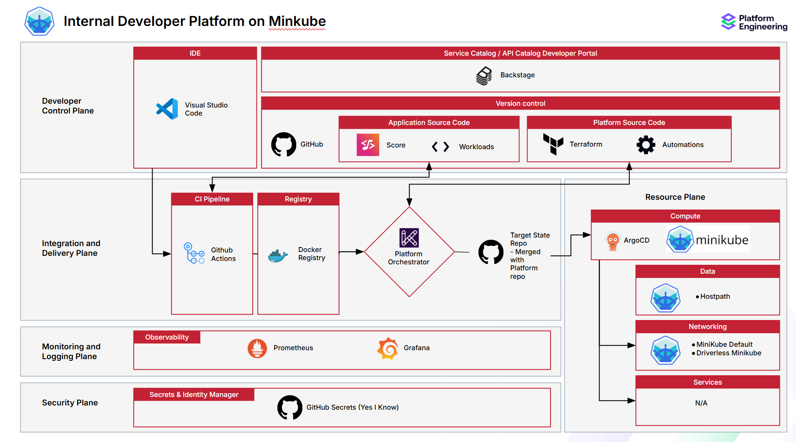

# platform-engineering-minikube-demo
# Requirements
On windows host
Requires docker
Requires latest version of WSL
Requires default version of WSL to be set to 2
You can install a fedora-41 container with the script `install-container.ps1`

The fedora-41 container tends to have its DNS settings messed up and also it tends to not us systemd.

Update `/etc/wsl.conf` to:
```
[network]
generateResolvConf=false
[boot]
systemd=true
```

Update `/etc/resolv.conf` to at least:
```
nameserver <your-favourite-dns-server>
```
Then install dotnet & git

git clone this repository on the wsl container

Then continue with kicking off `container-init.sh`

# Overview
Implementation of the platform engineering reference architecture for OpenShift but then just with regular Kubernetes running on Minikube for demo purposes.

V2 also adds an LLM server, firewall and MCP.

Designed for running on WSL with Fedora-41 as OS.

Scripts and resulting Github Runner have extensive access to the container and will install and write lots of files in lots of directories.
Do not run on WSL instance that is also used for other purposes.

Security shortcuts taken for easy and quick development. Do not expose WSL container to the wider network.

Developed for Fedora 41 running on WSL

Usage:
- Take the steps from "Requirements" above
- Clone repo (again) in  fedora 41 instance
- run init.sh to add a github runner (token can be gotten from github repo settings > actions )
    Note: this adds a dedicated Linux user with paswordless Sudo rights.
- Run the "configure_host.yml" action in Github actions
- Run the "deploy.yml" action in Github actions
- Add Python webserver scripts to the "webservices" folder
- Profit

V1 Desired end state architecture:

V2 Architecture to be added

# Features
- Add python webserver files to `webservices` directory and see them wrapped in docker container and deployed to Kubernetes using Github actions
- LLM server configured for interaction with webservices

To do:
Add RAG 
Add MCPs
Add firewalls between LLM and RAG
Some form of tenancy
YAML linting
Add firewall rules